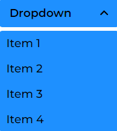
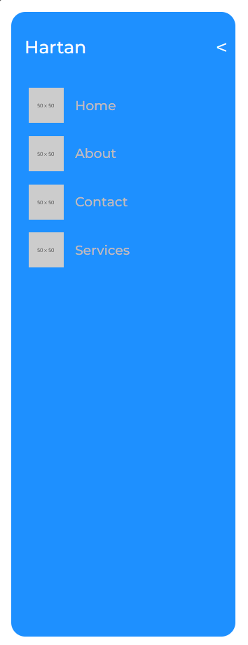

<p align="center">
  <a href="https://hartan.netlify.app">
    
  </a>
</p>

<h3 align="center">Hartan JS</h3>

<p align="center">
  An intuitive and customizable front-end UI Component Library for faster and easier web development.
  <br>
  <a href="https://github.com/HartanLibrary/react-hartan"><strong>Explore Hartan Docs »</strong></a>
  <br>
  <br>
  <a href="https://github.com/HartanLibrary/react-hartan/issues">Report bug</a>
  ·
  <a href="https://github.com/HartanLibrary/react-hartan/issues">Request feature</a>
  ·
  <a href="https://hartan.netlify.app/blogs">Blog</a>
</p>


# 👋 Welcome

Hartan is a UI component library built on React JS and distributed as a NPM package. It offers a collection of independent, well-documented resources designed to facilitate rapid website development.

We want to help developers to work more efficiently providing them with a simple yet customizable components library that helps them to build their websites rapidly without spending much time. Hartan presents clear and intuitive design principles, empowering users to easily customize and personalize their projects, ensuring that it fits well with the specific needs of the user.

## Table of Contents

- [Installation](#installation)
- [Documentation](#documentation)
- [Contribution](#contributing)
- [Demo](#demo)
- [Screenshots](#components-screenshots)
- [License](#license)


## Installation

Install with npm

```bash
  npm install react-hartan
```

Install with yarn

```bash
  yarn add react-hartan
```
    
## Documentation

Visit the [Hartan Docs](https://hartans-organization.gitbook.io/hartan-docs/) to for detailed explanations and usage.


## Contributing

Contributions are always welcome!

See [`contributing.md`](https://hartans-organization.gitbook.io/hartan-docs/contributing.md) for ways to get started.

Please adhere to this project's [`code of conduct`](/CODE_OF_CONDUCT.md).


## Demo

Try the components [here](https://hartan.netlify.app/preview).


## Components Screenshots

<br><br>
<br><br>
<br><br>
<br><br>
<br><br>
<br><br>
<br><br>
<br><br>
<br><br>
<br><br>
<br><br>
<br><br>
<br><br>
<br><br>
<br><br>


## License

[](/LICENSE.txt)

